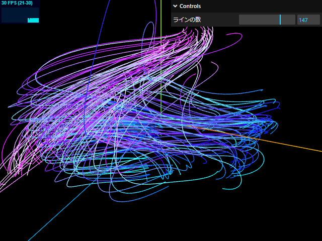

# Three.jsの練習帳

<br>

Github Pagesを使うために公開範囲をPublicにしていますが、このリポジトリは個人の学習のためのものです。

当面の目標は２つ。

## 目標１．ネットワーク構成図の３次元表現

大規模なネットワーク構成になると、
どうしても図としての表現が困難になってくるのと、
JavaScriptだけで描画すると重たくなってしまうのを解決したい。

試しに5-Stage CLOS ネットワークを3D作図したものがこれです。

[](https://takamitsu-iida.github.io/threejs-practice/index-nwdiagram.html)

[Live Demo](https://takamitsu-iida.github.io/threejs-practice/index-nwdiagram.html)

- (clusters, routers/cluster) = (10, 20) の場合、ルータ224台、エッジ440本
- (clusters, routers/cluster) = (20, 30) の場合、ルータ664台、エッジ1,280本
- (clusters, routers/cluster) = (30, 30) の場合、ルータ964台、エッジ1,920本

<br>

実用するなら見やすいレイアウトを追求しないといけませんが、たとえ見づらくてもアートっぽい雰囲気を感じられればそれでいいかな、という気になります。

<br>

> [!NOTE]
>
> グラフィックボードを持たないシンクライアントやWebGLをサポートしていないブラウザでは
>
> `Your graphics card does not seem to support WebGL`
>
> としか表示されません。
>
> 搭載しているGPUの性能によっては重い処理になります。
> 2015 EarlyモデルのMacbook Proでは60fps出せませんでした。


<br><br>

## 目標２．海底地形図作成

魚群探知機から抽出した水深のCSVデータを加工して3Dで海底地形図を表示したい。

まだまだ実力が足りないので、
まずはポイントクラウドを表示してみてどう見えるか。試しにやってみたのがこれです。

[](https://takamitsu-iida.github.io/threejs-practice/index-load-csv.html)

[Live Demo](https://takamitsu-iida.github.io/threejs-practice/index-load-csv.html)

用いたCSVのデータは10万ポイント。

ある程度はPythonで処理して異常値を弾いたつもりですが、まだまだおかしなデータが含まれてる感じがします。

|       |             lat |             lon |        depth |
|:------|----------------:|----------------:|-------------:|
| count | 107440          | 107440          | 107440       |
| mean  |     35.1641     |    139.608      |     16.4776  |
| std   |      0.00237647 |      0.00435879 |      9.62367 |
| min   |     35.1572     |    139.599      |      1.082   |
| 25%   |     35.1628     |    139.604      |      8.409   |
| 50%   |     35.164      |    139.608      |     15.09    |
| 75%   |     35.1649     |    139.61       |     21.928   |
| max   |     35.1737     |    139.622      |     47.539   |


<br>

ポイント数は十分だろうからデローネ三角形でポリゴン化してみようかな、と漠然と考えていたけど、
明らかにデータが密な場所と疎な場所で差がありすぎるので、
先にどうやってデータ補間するかを解決しないと。
もしくは、2Dでコンターを作成して、それを3D化した方がいいかな。

<!--

https://jamescheshire.github.io/learningR/interpolating-point-data.html

Thiessen Polygon ティーセンポリゴン
逆距離加重法 IDW (Inverse Distance Weighting)
通常距離加重法 NDW (Normal Distance Weighting)

-->


<br><br><br>

# 作例一覧

勉強用に作ったものを一覧化したものです。

スクリーンショットの画像をクリックするとライブデモを確認できます。

参照元は本家Three.jsであったり、Udemyであったり、ネット上の記事であったりとマチマチですが、
後で自分が参照するときに困らないようにソースコードはできるだけ同じような書き方に変えています。


<br>

## Node

球体でノードを表現する例。

グループ化することで内部にテクスチャを張っているが、作成する順番が重要で、球体を最後にしないと内部が見えなくなる。

選択したときのブリンクエフェクトは、内部のもう一つ同じサイズの球体を作成してvisibleをトグルすることで実現している。

[](https://takamitsu-iida.github.io/threejs-practice/index-node.html)

[Live Demo](https://takamitsu-iida.github.io/threejs-practice/index-node.html)

[HTML](https://github.com/takamitsu-iida/threejs-practice/blob/master/index-node.html)

[JavaScript](https://github.com/takamitsu-iida/threejs-practice/blob/master/static/site/js/node.js)


<br>

## Node and Edge

半透明に設定した物体を線で結ぶ場合に、物体の内部にある線を描画するか、しないか、を制御する例。

renderOrder, depthWrite, depthTest の組み合わせで制御する。

青い球体は内部まで線が描画されているのに対して、赤い球体は球の外側から線が描画されている。

[](https://takamitsu-iida.github.io/threejs-practice/index-node-edge.html)

[Live Demo](https://takamitsu-iida.github.io/threejs-practice/index-node-edge.html)

[HTML](https://github.com/takamitsu-iida/threejs-practice/blob/master/index-node-edge.html)

[JavaScript](https://github.com/takamitsu-iida/threejs-practice/blob/master/static/site/js/node-edge.js)


<br>

## CSS3D with Tween.js


本家Three.jsの例から引用。

レイアウトを決める方法が勉強になる。

Vector3には便利なメソッドがいっぱいある。

`Vector3.setFromSphericalCoords(radius : Float, phi : Float, theta : Float )` で球の上に配置。

`Vector3.setFromCylindricalCoords ( radius : Float, theta : Float, y : Float )` でスパイラル上に配置。


[](https://takamitsu-iida.github.io/threejs-practice/index-css3d-periodictable.html)

[Live Demo](https://takamitsu-iida.github.io/threejs-practice/index-css3d-periodictable.html)

[HTML](https://github.com/takamitsu-iida/threejs-practice/blob/master/index-css3d-periodictable.html)

[JavaScript](https://github.com/takamitsu-iida/threejs-practice/blob/master/static/site/js/css3d-periodictable.js)


<br>

## CatmullRomCurve3


`THREE.CatmullRomCurve3()` に適当な座標をいくつか与えて、滑らかな曲線を作る例。

複雑な曲線を滑らかにするにはそれなりのポイント数が必要であることがわかる。

[](https://takamitsu-iida.github.io/threejs-practice/index-curve.html)

[Live Demo](https://takamitsu-iida.github.io/threejs-practice/index-curve.html)

[HTML](https://github.com/takamitsu-iida/threejs-practice/blob/master/index-curve.html)

[JavaScript](https://github.com/takamitsu-iida/threejs-practice/blob/master/static/site/js/curve.js)


<br>

## Shadow

基本中の基本ではあるものの、影を綺麗に出すのは意外に調整が難しい。

[](https://takamitsu-iida.github.io/threejs-practice/index-shadow.html)

[Live Demo](https://takamitsu-iida.github.io/threejs-practice/index-shadow.html)

[HTML](https://github.com/takamitsu-iida/threejs-practice/blob/master/index-shadow.html)

[JavaScript](https://github.com/takamitsu-iida/threejs-practice/blob/master/static/site/js/shadow.js)


<br>

## Particles

Udemyの講座から引用。

Three.jsを初めて学習するときに大変助かった。

この例ではテクスチャをあてて綺麗にしている。

[](https://takamitsu-iida.github.io/threejs-practice/index-particles.html)

[Live Demo](https://takamitsu-iida.github.io/threejs-practice/index-particles.html)

[HTML](https://github.com/takamitsu-iida/threejs-practice/blob/master/index-particles.html)

[JavaScript](https://github.com/takamitsu-iida/threejs-practice/blob/master/static/site/js/particles.js)


<br>

## Flag using ShaderMaterial

Udemyの講座から引用。

ShaderMaterialとGLSLで記述したシェーダーを使った例。

初めてシェーダーを学習するときに大変助かった。

[](https://takamitsu-iida.github.io/threejs-practice/index-flag.html)

[Live Demo](https://takamitsu-iida.github.io/threejs-practice/index-flag.html)

[HTML](https://github.com/takamitsu-iida/threejs-practice/blob/master/index-flag.html)

[JavaScript](https://github.com/takamitsu-iida/threejs-practice/blob/master/static/site/js/flag.js)


<br>

## Wave using ShaderMaterial

Udemyの講座から引用。

ShaderMaterialとGLSLで記述したシェーダーを使った例。

綺麗に見せるには経験則的にパラメータをいろいろイジる必要があることを実感できる作例。

[](https://takamitsu-iida.github.io/threejs-practice/index-wave.html)

[Live Demo](https://takamitsu-iida.github.io/threejs-practice/index-wave.html)

[HTML](https://github.com/takamitsu-iida/threejs-practice/blob/master/index-wave.html)

[JavaScript](https://github.com/takamitsu-iida/threejs-practice/blob/master/static/site/js/wave.js)


<br>

## 地球

ICS MEDIAの [記事](https://ics.media/entry/10657/") から引用。

グループ化をうまく使っている例。とても勉強になった。

[](https://takamitsu-iida.github.io/threejs-practice/index-geoarc.html)

[Live Demo](https://takamitsu-iida.github.io/threejs-practice/index-geoarc.html)

[HTML](https://github.com/takamitsu-iida/threejs-practice/blob/master/index-geoarc.html)

[JavaScript](https://github.com/takamitsu-iida/threejs-practice/blob/master/static/site/js/geoarc.js)

<br>

## 回転するパーティクル

オブジェクトを回転させる方法を調べるために作成。

パーティクルの場合にどう回転するのか、を確認したもの。

[](https://takamitsu-iida.github.io/threejs-practice/index-rotate-points.html)

[Live Demo](https://takamitsu-iida.github.io/threejs-practice/index-rotate-points.html)

[HTML](https://github.com/takamitsu-iida/threejs-practice/blob/master/index-rotate-points.html)

[JavaScript](https://github.com/takamitsu-iida/threejs-practice/blob/master/static/site/js/rotate-points.js)

<br>

## クォータニオン

オブジェクトを回転させる方法を調べるために作成。

初期状態で傾きを付けられたオブジェクトを期待通りに回転させるのは意外に難しい。

[](https://takamitsu-iida.github.io/threejs-practice/index-quaternion.html)

[Live Demo](https://takamitsu-iida.github.io/threejs-practice/index-quaternion.html)

[HTML](https://github.com/takamitsu-iida/threejs-practice/blob/master/index-quaternion.html)

[JavaScript](https://github.com/takamitsu-iida/threejs-practice/blob/master/static/site/js/quaternion.js)


<br>

## プレーンジオメトリ

基本中の基本。

ジオメトリの座標を時間経過で加工して波打たせたもの。

[](https://takamitsu-iida.github.io/threejs-practice/index-plane-wave.html)

[Live Demo](https://takamitsu-iida.github.io/threejs-practice/index-plane-wave.html)

[HTML](https://github.com/takamitsu-iida/threejs-practice/blob/master/index-plane-wave.html)

[JavaScript](https://github.com/takamitsu-iida/threejs-practice/blob/master/static/site/js/plane-wave.js)

<br>

## 地形・その１

本家Three.jsの例から引用。

この例はわからないところが多いのでさらなる深堀りが必要。

[](https://takamitsu-iida.github.io/threejs-practice/index-terrain.html)

[Live Demo](https://takamitsu-iida.github.io/threejs-practice/index-terrain.html)

[HTML](https://github.com/takamitsu-iida/threejs-practice/blob/master/index-terrain.html)

[JavaScript](https://github.com/takamitsu-iida/threejs-practice/blob/master/static/site/js/terrain.js)

<br>

## 地形・その２

深堀りした結果、だいぶ分かってきた。

地形を生成する最小コードはこれだと思う。

[](https://takamitsu-iida.github.io/threejs-practice/index-terrain2.html)

[Live Demo](https://takamitsu-iida.github.io/threejs-practice/index-terrain2.html)

[HTML](https://github.com/takamitsu-iida/threejs-practice/blob/master/index-terrain2.html)

[JavaScript](https://github.com/takamitsu-iida/threejs-practice/blob/master/static/site/js/terrain2.js)

<br>

## 地形・その３

元になるデータがグリッドの場合は三角形のポリゴンを簡単に作れるけど、データが点群だった場合にどうするか。

これを解決するのがデローネ三角形（Delaunary Triangulation）。デローネ三角形については英語版のWikipediaに詳しい説明がある。

DelaunatorというJavaScriptのライブラリがあるので、これを使うと簡単に点群をポリゴン化できる。

引用元は[ここ](https://hofk.de/main/discourse.threejs/2018/Triangulation/Triangulation.html)

[](https://takamitsu-iida.github.io/threejs-practice/index-delaunary-triangulation.html)

[Live Demo](https://takamitsu-iida.github.io/threejs-practice/index-delaunary-triangulation.html)

[HTML](https://github.com/takamitsu-iida/threejs-practice/blob/master/index-delaunary-triangulation.html)

[JavaScript](https://github.com/takamitsu-iida/threejs-practice/blob/master/static/site/js/delaunary-triangulation.js)

<br>

## プレーンジオメトリで地形

ネットに掲載されていたシェーダーの使用例からシェーダー部分を取り除いたもの。

プレーンジオメトリにパーリンノイズを乗せて歪ませている。

[](https://takamitsu-iida.github.io/threejs-practice/index-plane.html)

[Live Demo](https://takamitsu-iida.github.io/threejs-practice/index-plane.html)

[HTML](https://github.com/takamitsu-iida/threejs-practice/blob/master/index-plane.html)

[JavaScript](https://github.com/takamitsu-iida/threejs-practice/blob/master/static/site/js/plane.js)

<br>

## シェーダーマテリアルで等圧線

上記の歪めたプレーンジオメトリに対してフラグメントシェーダーで等圧線を描画したもの。

模様として描いているに過ぎないので、使い道があるのか悩みどころ。

[](https://takamitsu-iida.github.io/threejs-practice/index-plane-grid.html)

[Live Demo](https://takamitsu-iida.github.io/threejs-practice/index-plane-grid.html)

[HTML](https://github.com/takamitsu-iida/threejs-practice/blob/master/index-plane-grid.html)

[JavaScript](https://github.com/takamitsu-iida/threejs-practice/blob/master/static/site/js/plane-grid.js)


<br>

## 組み込みシェーダー加工

`onBeforeCompile` を使って組み込みシェーダーを加工して等高線を描画したもの。

Three.jsの組み込みシェーダーって、実行するたびにコンパイルしてるのね。

[](https://takamitsu-iida.github.io/threejs-practice/index-plane-grid2.html)

[Live Demo](https://takamitsu-iida.github.io/threejs-practice/index-plane-grid2.html)

[HTML](https://github.com/takamitsu-iida/threejs-practice/blob/master/index-plane-grid2.html)

[JavaScript](https://github.com/takamitsu-iida/threejs-practice/blob/master/static/site/js/plane-grid2.js)


<br>

## Marching Squares

マーチングスクエア法をThree.jsで実装したもの。

2Dで等圧線を作るときに役に立つかも。

せっかく3Dで表示できるんだから、もうちょっと見た目を綺麗にした方がよかったかもしれない。


[](https://takamitsu-iida.github.io/threejs-practice/index-marching-squares.html)

[Live Demo](https://takamitsu-iida.github.io/threejs-practice/index-marching-squares.html)

[HTML](https://github.com/takamitsu-iida/threejs-practice/blob/master/index-marching-squares.html)

[JavaScript](https://github.com/takamitsu-iida/threejs-practice/blob/master/static/site/js/marching-squares.js)


<br>

## Marching Cubes

マーチングキューブ法を使って等値面を描画し、地形図のように見せたもの。

[Terrain Generation and Editing using Marching Cubes](https://deep110.github.io/posts/blogs/2022-06-25-terrain-editor-marching-cubes.html)を元に作成。

元記事のコードは間違っている部分があるので要注意。

あくまで等値面を描画しているだけなので地形図の作成には使えないが、ポリゴンの作り方やFloat32Arrayでのバッファの持ち方など、とても勉強になった。


[](https://takamitsu-iida.github.io/threejs-practice/index-marching-cubes.html)

[Live Demo](https://takamitsu-iida.github.io/threejs-practice/index-marching-cubes.html)

[HTML](https://github.com/takamitsu-iida/threejs-practice/blob/master/index-marching-cubes.html)

[JavaScript](https://github.com/takamitsu-iida/threejs-practice/blob/master/static/site/js/marching-cubes.js)


<br>

## Lookup Table

頂点の座標に応じて色を付ける例。ヒートマップを表現するのに便利。


Three.jsのexamplesにある[webgl_geometry_colors_lookuptable](https://threejs.org/examples/#webgl_geometry_colors_lookuptable)を参考に作成。

Lut.jsを使うと数字から色に変換できるので、あとは力技で頂点に色を付けている。

組み込みで定義されているカラーマップは4個（'rainbow', 'cooltowarm', 'blackbody', 'grayscale'）だけなので、別の色を使いたい場合はLut.jsを直接書き換えればいい。

なお、バージョンr168に同梱されているLut.jsを使うとChromeのコンソールにwarningが出るので、1行だけ書き換えて使っている。

[](https://takamitsu-iida.github.io/threejs-practice/index-lookuptable.html)

[Live Demo](https://takamitsu-iida.github.io/threejs-practice/index-lookuptable.html)

[HTML](https://github.com/takamitsu-iida/threejs-practice/blob/master/index-lookuptable.html)

[JavaScript](https://github.com/takamitsu-iida/threejs-practice/blob/master/static/site/js/lookuptable.js)

<br>

## Load CSV point cloud

魚群探知機から抽出した水深のCSVデータをロードして点群として表示する例。

CSVの転送に時間がかかるので、その間はローディング画面を表示。

単に表示するだけならパーティクルと同じく `THREE.Points()` を使うと簡単にできる。

[](https://takamitsu-iida.github.io/threejs-practice/index-load-csv.html)

[Live Demo](https://takamitsu-iida.github.io/threejs-practice/index-load-csv.html)

[HTML](https://github.com/takamitsu-iida/threejs-practice/blob/master/index-load-csv.html)

[JavaScript](https://github.com/takamitsu-iida/threejs-practice/blob/master/static/site/js/load-csv.js)

<br>

## InstancedMesh with SelectionBox

メッシュを一つ作成して、GPUに同じ物を複数作れ、と指示するのが `THREE.InstancedMesh `で、これを使って点群を表示することもできる。

SelectionBoxを使うと、GPU側で作成した個々のメッシュを選択できる。

ただし、選択はできるものの、個々のメッシュに独自のアトリビュートを持たせられるわけではないので、色を変えるとか、見た目を変えることしかできない。


[](https://takamitsu-iida.github.io/threejs-practice/index-load-csv-instancedmesh-selectionbox.html)

[Live Demo](https://takamitsu-iida.github.io/threejs-practice/index-load-csv-instancedmesh-selectionbox.html)

[HTML](https://github.com/takamitsu-iida/threejs-practice/blob/master/index-load-csv-instancedmesh-selectionbox.html)

[JavaScript](https://github.com/takamitsu-iida/threejs-practice/blob/master/static/site/js/load-csv-instancedmesh-selectionbox.js)

<br>

## InstancedBufferGeometry with SelectionBox

ジオメトリを一つ作成して、GPUに同じものを複数作れ、と指示するのが `THREE.InstancedBufferGeometry` で、これを使うと任意のアトリビュートを持たせることができる。

ただし、普通にメッシュ化すると一つのメッシュになってしまうのでSelectionBoxで選択できるのは点群全体になってしまう。

そこでInstancedMeshを組み合わせてメッシュ化すると、個々のメッシュを選択でき、かつ個々のメッシュに独自のアトリビュートを持たせられる。

点群のいらない部分、異常値っぽい部分をSelectionBoxで選択して削除し、新たなCSVファイルとしてダウンロードできるようにしたのがこれ。

削除といっても実際には点群の色を背景色と同じにして見えなくしているだけで、画面上には存在している。

独自のアトリビュートremovedに値を設定して、削除済みであることをマークして、CSVをダウンロードするときにそれらを除外している。


[](https://takamitsu-iida.github.io/threejs-practice/index-load-csv-instancedgeometry-selectionbox.html)

[Live Demo](https://takamitsu-iida.github.io/threejs-practice/index-load-csv-instancedgeometry-selectionbox.html)

[HTML](https://github.com/takamitsu-iida/threejs-practice/blob/master/index-load-csv-instancedgeometry-selectionbox.html)

[JavaScript](https://github.com/takamitsu-iida/threejs-practice/blob/master/static/site/js/load-csv-instancedgeometry-selectionbox.js)

<br>

## Load Topojson ExtrudeGeometry

Topojsonを読み込んでパスシェイプを作り、ExtrudeGeometryで立体化した例。

魚探のデータだけだと海岸線がわからないので、topojsonのデータをなんとかしてThree.js側で表示したいと思って作ったもの。

Topojsonは手持ちで持っていた神奈川県三浦市のものを利用。

三浦市のデータは'Polygon'しかないので、'MultiPolygon'や'LineString'が含まれる地図データを使うと恐らくうまく動かないと思う。

本当に正しく三浦市の形に描画できているか不安になるが、ボート釣りのホームグランドの油壷付近は確かに見覚えがある。

なお、そのままだと小さいので適当に拡大しているが、topojsonデータにはscale情報も格納されているので、うまく処理すれば画面サイズにフィットするように大きさを調整できると思う。

[](https://takamitsu-iida.github.io/threejs-practice/index-load-topojson-extrudegeometry.html)

[Live Demo](https://takamitsu-iida.github.io/threejs-practice/index-load-topojson-extrudegeometry.html)

[HTML](https://github.com/takamitsu-iida/threejs-practice/blob/master/index-load-topojson-extrudegeometry.html)

[JavaScript](https://github.com/takamitsu-iida/threejs-practice/blob/master/static/site/js/load-topojson-extrudegeometry.js)

<br>

## Load TopoJSON ShapeGeometry (Part 1)

TopoJSONを読み込んでパスシェイプを作り、ShapeGeometryで表示した例。

日本地図のTopoJSONは[ここ](https://github.com/dataofjapan/land)から頂いた。

県単位でFeatureが格納されているので、メッシュ化も県単位。

そのおかげでレイキャスターを使えばマウスオーバーで県の色を変えることくらいは容易にできるはず。

[](https://takamitsu-iida.github.io/threejs-practice/index-load-topojson-shapegeometry.html)

[Live Demo](https://takamitsu-iida.github.io/threejs-practice/index-load-topojson-shapegeometry.html)

[HTML](https://github.com/takamitsu-iida/threejs-practice/blob/master/index-load-topojson-shapegeometry.html)

[JavaScript](https://github.com/takamitsu-iida/threejs-practice/blob/master/static/site/js/load-topojson-shapegeometry.js)

<br>

## Load TopoJSON ShapeGeometry (Part 2)

県の上にマウスオーバーすると、県の名前が表示されるようにクイックハック。

[](https://takamitsu-iida.github.io/threejs-practice/index-load-topojson-shapegeometry2.html)

[Live Demo](https://takamitsu-iida.github.io/threejs-practice/index-load-topojson-shapegeometry2.html)

[HTML](https://github.com/takamitsu-iida/threejs-practice/blob/master/index-load-topojson-shapegeometry2.html)

[JavaScript](https://github.com/takamitsu-iida/threejs-practice/blob/master/static/site/js/load-topojson-shapegeometry2.js)

<br>

## Load GeoJSON (Part 1)

GeoJSONを読み込んでTHREE.LineSegmentsでワイヤーフレームを表示した例。

[ここ](https://observablehq.com/@mbostock/geojson-in-three-js)を参考に作成。

d3.jsで書かれた部分は何が行われているのかよくわからないので、GeoJSONのデータだけ頂いて自分で理解できるやり方で実装したもの。

GeoJSONは点と点を線で繋いでいく形式なので、LineSegmentsで表示するのが簡単でよい。

地図を塗りつぶすにはポリゴン化しなければいけないので、現実的なCPUリソースの範囲内で実現するのは困難になる。その場合は球体に地図のテクスチャを貼ってしまった方が良い。

[](https://takamitsu-iida.github.io/threejs-practice/index-load-geojson.html)

[Live Demo](https://takamitsu-iida.github.io/threejs-practice/index-load-geojson.html)

[HTML](https://github.com/takamitsu-iida/threejs-practice/blob/master/index-load-geojson.html)

[JavaScript](https://github.com/takamitsu-iida/threejs-practice/blob/master/static/site/js/load-geojson.js)

<br>

## Load GeoJSON (Part 2)

球体にテクスチャを貼った上にGeoJSONでワイヤフレームを描画した例。

国を表示するテクスチャがあるといいんだけど、そう都合よく見つからないので、取り急ぎは手持ちのテクスチャでやってみた。

[](https://takamitsu-iida.github.io/threejs-practice/index-load-geojson2.html)

[Live Demo](https://takamitsu-iida.github.io/threejs-practice/index-load-geojson2.html)

[HTML](https://github.com/takamitsu-iida/threejs-practice/blob/master/index-load-geojson2.html)

[JavaScript](https://github.com/takamitsu-iida/threejs-practice/blob/master/static/site/js/load-geojson2.js)


<br>

## Load GeoJSON (Part 3)

都市間を`CubicBezierCurve3`で作成した曲線で繋いだもの。

[ここ](https://medium.com/@xiaoyangzhao/drawing-curves-on-webgl-globe-using-three-js-and-d3-draft-7e782ffd7ab)を参考に作成。

[](https://takamitsu-iida.github.io/threejs-practice/index-load-geojson3.html)

[Live Demo](https://takamitsu-iida.github.io/threejs-practice/index-load-geojson3.html)

[HTML](https://github.com/takamitsu-iida/threejs-practice/blob/master/index-load-geojson3.html)

[JavaScript](https://github.com/takamitsu-iida/threejs-practice/blob/master/static/site/js/load-geojson3.js)

<br>

## Load GeoJSON (Part 4) GPGPU

GPGPUで線が動いているようにしたもの。あまり美しくできなかった・・・

GPGPUで線を動かしている部分は難解なので、時間をおいたら自分でもわからなくなる。

いま思うと、わざわざ線を動かさなくても Directional line using shader の例にあるように線の色を変えるだけでよかったのでは？
次に実装するときはそうしよう。

既知の不具合

- 新しい場所にパーティクルを飛ばしたときに直線が描画されてしまう（ワイヤフレームだけにすると分かる）

[](https://takamitsu-iida.github.io/threejs-practice/index-load-geojson4.html)

[Live Demo](https://takamitsu-iida.github.io/threejs-practice/index-load-geojson4.html)

[HTML](https://github.com/takamitsu-iida/threejs-practice/blob/master/index-load-geojson4.html)

[JavaScript](https://github.com/takamitsu-iida/threejs-practice/blob/master/static/site/js/load-geojson4.js)

世界の首都の座標は[ここ](https://note.com/kentoide/n/n16354c4b3458)から頂いた。

<br>

## Point Globe (InstancedMesh)

地図っぽいテクスチャがあると便利なんだけど、探しても見つからない。

手持ちの地図にgeo_specular.pngというファイルがあり、本来の目的は光の反射率を計算するためのものらしいけど、
いい具合に白黒で表現されてるので海なのか地面なのかの判定に使ってみた。

緯度経度のグリッドを走査して、その座標が地面なら六角形を描画する。

この例だと53,388個の六角形を描画しているが、六角形を個別にメッシュ化してしまうとさすがに重たくなるので、
InstancedMeshを使ってGPU側で複製するようにした。

地球の球体の周りがぼんやりとしているのは大気を表現したもので、シェーダーのコードは[ここ](https://franky-arkon-digital.medium.com/make-your-own-earth-in-three-js-8b875e281b1e)から頂いた。

[](https://takamitsu-iida.github.io/threejs-practice/index-point-globe.html)

[Live Demo](https://takamitsu-iida.github.io/threejs-practice/index-point-globe.html)

[HTML](https://github.com/takamitsu-iida/threejs-practice/blob/master/index-point-globe.html)

[JavaScript](https://github.com/takamitsu-iida/threejs-practice/blob/master/static/site/js/point-globe.js)

<br>

## Move along path

オブジェクトをパスに沿って移動させる例。

[この例](https://observablehq.com/@rveciana/three-js-object-moving-object-along-path)をそのまま引用。

魚群探知機から抽出したGPS座標に沿ってオブジェクトを移動するなら、この例が使えそう。

[](https://takamitsu-iida.github.io/threejs-practice/index-move-along-path.html)

[Live Demo](https://takamitsu-iida.github.io/threejs-practice/index-move-along-path.html)

[HTML](https://github.com/takamitsu-iida/threejs-practice/blob/master/index-move-along-path.html)

[JavaScript](https://github.com/takamitsu-iida/threejs-practice/blob/master/static/site/js/move-along-path.js)

<br>

## Move along path （イマイチ）

ということで、１回の釣行で得られる魚群探知機のデータを可視化してみた例。

グレーの線がボートの移動を、緑の線が水深を表している。

ボートの向きは必ずしも進行方向を向いていないのが分かる。

魚探の電源を切っている時間が散在するので、データの加工をもう少し工夫しないとだめだなぁ・・・

[](https://takamitsu-iida.github.io/threejs-practice/index-move-along-path2.html)

[Live Demo](https://takamitsu-iida.github.io/threejs-practice/index-move-along-path2.html)

[HTML](https://github.com/takamitsu-iida/threejs-practice/blob/master/index-move-along-path2.html)

[JavaScript](https://github.com/takamitsu-iida/threejs-practice/blob/master/static/site/js/move-along-path2.js)

<br>

## Move along path

パーティクルをパスに沿って移動させる例。

Curveクラスが持っている `getPointAt(fraction)` を使うとパス上の任意の場所の座標を得られるので、そこにpositionを移動すればいい。

ただし、位置の指定をJavaScript側でフレームごとに実行しているので、多数のパーティクルを使うと重くなってしまう。

[](https://takamitsu-iida.github.io/threejs-practice/index-move-along-path3.html)

[Live Demo](https://takamitsu-iida.github.io/threejs-practice/index-move-along-path3.html)

[HTML](https://github.com/takamitsu-iida/threejs-practice/blob/master/index-move-along-path3.html)

[JavaScript](https://github.com/takamitsu-iida/threejs-practice/blob/master/static/site/js/move-along-path3.js)

<br>

## GPGPU move along path (Part 1)

パーティクルをパスに沿って移動させる例。

見た目は前述のものとまったく同じ。

パーティクルの位置を事前に計算してテクスチャに保存しておき、シェーダーでそれを参照して位置を変えていく。

JavaScript側はfractionの値を更新するだけなので、CPUに負荷はかからない。

GPGPUの例は探せばいくつも出てくるけど、どれもこれも難しい。このくらい簡単な例から入れば、すぐにキャッチアップできると思う。

[](https://takamitsu-iida.github.io/threejs-practice/index-gpgpu-move-along-path.html)

[Live Demo](https://takamitsu-iida.github.io/threejs-practice/index-gpgpu-move-along-path.html)

[HTML](https://github.com/takamitsu-iida/threejs-practice/blob/master/index-gpgpu-move-along-path.html)

[JavaScript](https://github.com/takamitsu-iida/threejs-practice/blob/master/static/site/js/gpgpu-move-along-path.js)

<br>

## GPGPU move along path (Part 2)

パーティクルをパスに沿って移動させる例。

GPGPUを使えばCPUに負荷がかからないことを確かめるために、多数のパーティクルをパスに沿って移動させた例。

100本のパス上に100個のパーティクルを配置したので、総数1万個のパーティクルが移動している。

動かしてみれば分かるが、ブラウザが重くなるようなことはない。

[](https://takamitsu-iida.github.io/threejs-practice/index-gpgpu-move-along-path2.html)

[Live Demo](https://takamitsu-iida.github.io/threejs-practice/index-gpgpu-move-along-path2.html)

[HTML](https://github.com/takamitsu-iida/threejs-practice/blob/master/index-gpgpu-move-along-path2.html)

[JavaScript](https://github.com/takamitsu-iida/threejs-practice/blob/master/static/site/js/gpgpu-move-along-path2.js)

<br>

## GPGPU move along path (Part 3)

Part1と2の場合、事前に作成したテクスチャをuniformで渡してるだけで、GPGPUと言えるほどのことはしていない。

パーティクルの位置計算もGPUで処理するようにしたのがこれ。

フレームの更新ごとに`compute()`を実行してGPUで位置情報のテクスチャを更新。テクスチャに格納されている位置情報を読み取ってパーティクルを表示する。

ついでなのでlil-guiでパラメータを変更できるようにしておいた。最大で200本のパス上を200個のパーティクルが移動する。

[](https://takamitsu-iida.github.io/threejs-practice/index-gpgpu-move-along-path3.html)

[Live Demo](https://takamitsu-iida.github.io/threejs-practice/index-gpgpu-move-along-path3.html)

[HTML](https://github.com/takamitsu-iida/threejs-practice/blob/master/index-gpgpu-move-along-path3.html)

[JavaScript](https://github.com/takamitsu-iida/threejs-practice/blob/master/static/site/js/gpgpu-move-along-path3.js)

<br>

## GPGPU move along wind flow (Part 1)

天気予報でもよく見かける風の可視化。

自分でもやってみたいので、Three.jsでの実装を探してみたら[ここ](https://qiita.com/Kanahiro/items/8927619c64831972c1d2)にあった。

しかしながら、ソースコードを見てみたものの実力不足で理解できず orz

自分で理解できる方法で実装してみたのがこれ。

とりあえず、見た目の美しさは度外視して、5万個のパーティクルを風に流されるように移動させてみた。

風のデータは[ここ](https://github.com/mapbox/webgl-wind)から取得。

画像の色に風のベクトルが記録されていて、RGBのRがX方向、GがY方向の風を表している。

[](https://takamitsu-iida.github.io/threejs-practice/index-gpgpu-move-along-wind.html)

[Live Demo](https://takamitsu-iida.github.io/threejs-practice/index-gpgpu-move-along-wind.html)

[HTML](https://github.com/takamitsu-iida/threejs-practice/blob/master/index-gpgpu-move-along-wind.html)

[JavaScript](https://github.com/takamitsu-iida/threejs-practice/blob/master/static/site/js/gpgpu-move-along-wind.js)

<br>

## GPGPU move along wind flow (Part 2)

クイックハックしてパーティクルの軌跡を描画してみたのがこれ。軌跡がでると一気に雰囲気が変わる。

レンダラのオプション `preserveDrawingBuffer` を設定して、透明度0.01の板をカメラの前に設置しただけ。

透明度0.01といえど、100フレーム重ねれば1.0になって見えなくなるので、移動するパーティクルは短い尾をひくようになる。

ただし、背景も100フレーム経過後には見えなくなるし、その他の画像と重ね合わせることができないので、
ちゃんとやるにはオフスクリーンレンダリングを使って合成する必要がある。

[](https://takamitsu-iida.github.io/threejs-practice/index-gpgpu-move-along-wind2.html)

[Live Demo](https://takamitsu-iida.github.io/threejs-practice/index-gpgpu-move-along-wind2.html)

[HTML](https://github.com/takamitsu-iida/threejs-practice/blob/master/index-gpgpu-move-along-wind2.html)

[JavaScript](https://github.com/takamitsu-iida/threejs-practice/blob/master/static/site/js/gpgpu-move-along-wind2.js)

<br>

## GPGPU move along wind flow (Part 3) 失敗作

背景画像用のシーンとカメラを別に作成して、背景、パーティクルの順番でレンダリングするようにしたのがこれ。

画面がチラつくのでこのやり方ではダメなんだと思う。

[](https://takamitsu-iida.github.io/threejs-practice/index-gpgpu-move-along-wind3.html)

[Live Demo](https://takamitsu-iida.github.io/threejs-practice/index-gpgpu-move-along-wind3.html)

[HTML](https://github.com/takamitsu-iida/threejs-practice/blob/master/index-gpgpu-move-along-wind3.html)

[JavaScript](https://github.com/takamitsu-iida/threejs-practice/blob/master/static/site/js/gpgpu-move-along-wind3.js)

<br>

## GPGPU move along wind flow (Part 4) 完成

オフスクリーンでパーティクルをレンダリングしてテクスチャを作成して、１フレーム前のテクスチャと合成するようにしたのがこれ。

テクスチャの色を単純に加算するとパーティクルの色が白く飛んでしまうので、その対策として、

- 現在パーティクルが存在する場所、すなわちアルファ値が1.0のところは過去のテクスチャを加算しない
- 逆にパーティクルがない場所は過去のテクスチャだけを描画する

という要件をストレートに実装。パーティクルの色もちゃんと出てるし、これで良さそう。

```GLSL
  void test5() {
    vec4 curr = texture2D(u_current_texture, vUv);
    vec4 prev = texture2D(u_previous_texture, vUv);

    // 過去のフレームの色を少し暗くする
    prev -= vec4(vec3(0.0), 0.01);

    // curr.aを二値化、その値によってprevかcurrのどちらかを描画する
    gl_FragColor = mix(prev, curr, step(0.5, curr.a));
  }
```

[](https://takamitsu-iida.github.io/threejs-practice/index-gpgpu-move-along-wind4.html)

[Live Demo](https://takamitsu-iida.github.io/threejs-practice/index-gpgpu-move-along-wind4.html)

[HTML](https://github.com/takamitsu-iida/threejs-practice/blob/master/index-gpgpu-move-along-wind4.html)

[JavaScript](https://github.com/takamitsu-iida/threejs-practice/blob/master/static/site/js/gpgpu-move-along-wind4.js)

<br>

## GPGPU move along wind flow （見た目の調整のための改造版）

見た目を調整するために、GPGPUで用いているテクスチャのデータ構造を変更。

Part 1～4ではテクスチャの各ピクセルに(位置X, 位置Y, 速度X, 速度Y)を格納していた。
これを(位置X, 位置Y, 速度の絶対値, 経過フレーム数)に変更。

確率でランダムな位置にパーティクルを飛ばしていたのを、一定期間は必ず表示するように変更した。

[](https://takamitsu-iida.github.io/threejs-practice/index-gpgpu-move-along-wind5.html)

[Live Demo](https://takamitsu-iida.github.io/threejs-practice/index-gpgpu-move-along-wind5.html)

[HTML](https://github.com/takamitsu-iida/threejs-practice/blob/master/index-gpgpu-move-along-wind5.html)

[JavaScript](https://github.com/takamitsu-iida/threejs-practice/blob/master/static/site/js/gpgpu-move-along-wind5.js)

<br>

## GPGPU Particle trail

頂点を移動すると共に、その尻尾を描画する例。

フレームごとに時刻情報だけをuniformでGPUに渡して、線を移動させる処理は全てGPUで処理している。

中身は[この例](https://qiita.com/ukonpower/items/26411c4fa588cd2e772e)を手直ししたもの。

GPGPUを簡単に使えるようにするヘルパー GPUComputationRenderer.js を使っているものの、それでも難解。

後から見直したときに分かるようにコメントを多めに書いておいた。

[](https://takamitsu-iida.github.io/threejs-practice/index-gpgpu-particles3.html)

[Live Demo](https://takamitsu-iida.github.io/threejs-practice/index-gpgpu-particles3.html)

[HTML](https://github.com/takamitsu-iida/threejs-practice/blob/master/index-gpgpu-particles3.html)

[JavaScript](https://github.com/takamitsu-iida/threejs-practice/blob/master/static/site/js/gpgpu-particles3.js)

<br>

## Transform using shader

シェーダーでオブジェクトを移動、変形する例。

[ここ](https://misora.main.jp/blog/archives/213)から引用。

[](https://takamitsu-iida.github.io/threejs-practice/index-transform-shader.html)

[Live Demo](https://takamitsu-iida.github.io/threejs-practice/index-transform-shader.html)

[HTML](https://github.com/takamitsu-iida/threejs-practice/blob/master/index-transform-shader.html)

[JavaScript](https://github.com/takamitsu-iida/threejs-practice/blob/master/static/site/js/transform-shader.js)

<br>

## Directional line using shader (Part 1)

シェーダーでラインに動く色を付けて向きを表現した例。

ジオメトリの頂点に0～1で正規化した長さ情報をアトリビュートで仕込んでおき、シェーダーでそれをsin()して値が正の場合に色を変えている。

直線の場合は始点と終点の2点しか存在しないが、シェーダーに渡るときにはいい具合に値が補間されていることが分かる。

動く方向も頂点ごとにアトリビュートで仕込んでいて、directionアトリビュートの値が0.5を超えると逆方向になるようにしている。

直線の場合、始点のdirectionアトリビュートを0、終点を1にすると、両端から進んで真ん中で合流するようになる。

いまいち美しく描画されないのは、太さが1.0で固定になっているせい？

[](https://takamitsu-iida.github.io/threejs-practice/index-line-shader.html)

[Live Demo](https://takamitsu-iida.github.io/threejs-practice/index-line-shader.html)

[HTML](https://github.com/takamitsu-iida/threejs-practice/blob/master/index-line-shader.html)

[JavaScript](https://github.com/takamitsu-iida/threejs-practice/blob/master/static/site/js/line-shader.js)


<br>

## Directional line using shader (Part 2)

THREE.TubeGeometryを使って線を太くして、シェーダーで動く色を付けて向きを表現した例。

直線の場合、始点と終点の2点で表現できるけど、両端から描画する場合には点数を増やしておいた方がよい（理由は動かしてみれば分かる）

[](https://takamitsu-iida.github.io/threejs-practice/index-line-shader2.html)

[Live Demo](https://takamitsu-iida.github.io/threejs-practice/index-line-shader2.html)

[HTML](https://github.com/takamitsu-iida/threejs-practice/blob/master/index-line-shader2.html)

[JavaScript](https://github.com/takamitsu-iida/threejs-practice/blob/master/static/site/js/line-shader2.js)


<!--

<br>

##

[]()

[Live Demo]()

[HTML]()

[JavaScript]()

 -->

<br><br><br><br><br><br><br><br><br><br><br>

# 以下、すべて自分用メモ

<br><br>


# 参考文献

[three.js](https://threejs.org/)

[examples(かなり古い)](http://stemkoski.github.io/Three.js/)

[terrain building with three.js](https://blog.mastermaps.com/2013/10/terrain-building-with-threejs.html)

[Terrain Generation and Editing using Marching Cubes](https://deep110.github.io/posts/blogs/2022-06-25-terrain-editor-marching-cubes.html)

[three.jsのPlaneGeometryで地形を作る](https://yomotsu.net/blog/2012/12/01/create-terrain-with-threejs.html)

[WebGL開発に役立つ重要な三角関数の数式・概念まとめ（Three.js編）](https://ics.media/entry/10657/)

[Basic examples from https://discourse.threejs.org](https://hofk.de/main/discourse.threejs/2023/index2023.html)


<br>

# 実行環境

ブラウザ上で動くのでどんなPCでも動くと思いきや、そうでもないようです。

WindowsのChromeでは動いているのに、MacOSでは以下のメッセージがコンソールに出力されて何も描画されないことがありました。

```
[.WebGL-0x12004ecc700] GL_INVALID_OPERATION:
 Vertex buffer is not big enough for the draw callUnderstand this warning
```

ジオメトリの頂点を直接操作したときにこのメッセージが出ることが多いようですが、
プログラム側に何かしら問題があるはずなので、なるべく早い段階でMacOSでも期待通りの動作をするか、
を確認した方がよさそうです。

あらかた完成してから、MacOSでは動かない、となると、トラブルシューティングが大変になってしまうので。

<br>

# 環境構築メモ

three.jsをどこから読み込むか、によってHTML、JavaScriptの記述が変わります。

方法１．ローカルにthree.jsのソースコードをまるごと展開

方法２．ローカルに必要なものだけをコピーして参照

方法３．CDNを参照


開発中はvscodeの補完が働かないと難儀します。
ローカルにコピーしたthree.jsを読むようにすると補完がかかりますので、方法１ or 方法２で開発するとよいでしょう。

このリポジトリでは次のようなディレクトリ構成にしています。

```bash
├── README.md
├── index-nwdiagram.html
└── static
    ├── build
    │   ├── three.module.js
    │   └── three.module.min.js
    ├── controls
    │   ├── OrbitControls.js
    │   ├── TrackballControls.js
    │   └── TransformControls.js
    ├── libs
    │   ├── CSS2DRenderer.js
    │   ├── CSS3DRenderer.js
    │   ├── capabilities
    │   │   ├── WebGL.js
    │   │   └── WebGPU.js
    │   ├── lil-gui.module.min.js
    │   ├── stats.module.js
    │   └── tween.module.js
    └── site
        ├── css
        │   └── style.css
        ├── img
        │   ├── earth.jpg
        │   ├── favicon.ico
        │   ├── particle.png
        │   └── space.jpg
        └── js
            ├── nwdiagram.js
            ├── particles.js
            ├── practice.js
            └── terrain.js
```

github pagesで表示するHTMLはプロジェクト直下に配置しています（/docsにはしていません）。

静的コンテンツは./staticの下に配置します。

./static/buildにはthree.js本体を配置。

./static/controlsに各種コントローラを配置。実体は `three.js-master/examples/jsm/controls` からコピーしたものです。

./static/libsにはThree.jsに関連したアドオンやライブラリをコピーしておきます。

libsフォルダには必要なものを必要なときにコピーしているので、混沌としがちです。
これ、どこからコピーしたんだっけ？という状況にすでになっています。

<br>

## 方法１．ローカルにthree.jsのソースコードを展開

three.jsのバージョンを切り替えて試行するならこの方法がよいと思います。

- プロジェクト内にthreejsフォルダを作成して、three.jsをダウンロードして解凍

- .gitignoreでthreejsフォルダを無視するように設定

- index.htmlで次のように指定

```html
  <script type="importmap">
    {
      "imports": {
        "three": "./threejs/three.js-r145/build/three.module.js",
        "OrbitControls": ./threejs/three.js-r145/examples/jsm/controls/OrbitControls.js"
      }
    }
  </script>
```

<br>

> [!NOTE]
>
> HTML内に記述するimportmapの書式には十分注意しないといけません。
> 最後の行にコンマをつけると書式エラーになって何も表示されなくなりますので、 特に注意が必要です。

<br>

- JavaScriptで次のようにインポート指定

```js
import * as THREE from "three";
import { OrbitControls } from "OrbitControls";
```

<br>

## 方法２．ローカルに必要なものだけをコピーして参照

<br>

> [!NOTE]
>
> 2024年7月追記、現在はこの方法にしています。

<br>

> [!NOTE]
>
> 2024年8月追記
>
> three.jsをバージョンr168に入れ替えました。

<br>

- HTMLでの指定

```html
  <!-- three.js -->
  <script type="importmap">
    {
      "imports": {
        "three": "./static/build/three.module.js",
        "three/libs/": "./static/libs/",
        "three/controls/": "./static/controls/"
      }
    }
  </script>

  <script type="module">
    import WebGL from './static/libs/capabilities/WebGL.js';
    import { main } from "./static/site/js/nwdiagram.js";

    window.addEventListener("load", () => {
      if (WebGL.isWebGLAvailable()) {
        main();
      } else {
        document.getElementById("threejs_wrapper").appendChild(WebGL.getWebGLErrorMessage());
      }
    });
  </script>
```

- JavaScriptでのインポート指定

```js
import * as THREE from "three";
import { OrbitControls } from 'three/controls/OrbitControls.js';
import { CSS2DRenderer, CSS2DObject } from 'three/libs/CSS2DRenderer.js';
import { GUI } from "three/libs/lil-gui.module.min.js";
import Stats from 'three/libs/stats.module.js';
```

<br>

## 方法３．CDNを参照

配布するならCDNを参照するように書き換えた方がいいでしょう。

- index.htmlでの指定

```html
  <script type="importmap">
    {
      "imports": {
        "three": "https://unpkg.com/three/build/three.module.js",
        "OrbitControls": "https://unpkg.com/three@0.145/examples/jsm/controls/OrbitControls.js"
      }
    }
  </script>
```

- JavaScriptでのインポート指定

```js
import * as THREE from "three";
import { OrbitControls } from "OrbitControls"
```


<br>

##  アニメーションGIFに保存する方法

これ（↓）を使えばアニメーションGIFを作成できるものの、とてつもなく重いので別の手段を考えたほうがいいでしょう。

https://github.com/spite/ccapture.js

使い方

```JavaScript
    // ccapture.js
    {
      const startButton = document.getElementById("idButtonCaptureStart");
      if (startButton) {
        startButton.addEventListener("click", (event) => {
          event.preventDefault();
          event.stopPropagation();
          const options = {
            verbose: false,
            display: true,
            framerate: 30,
            format: 'gif',
            workersPath: './static/libs/ccapture.js-1.0.9/',
            timeLimit: 5,
            onProgress: (p) => {
              console.log(p);
              if (p === 1) {
                console.log("FINISHED!");
                document.getElementById("idButtonCaptureStart").disabled = false;
                this.capture = null;
              }
            }
          };
          document.getElementById("idButtonCaptureStart").disabled = true;
          this.capture = new CCapture(options);
          this.capture.start();
        });
      }
    }
```

<br>

## VSCodeの拡張機能

シェーダーを書くことになるので、拡張機能を導入します。

- Shader languages support for VS Code

- Comment tagged templates

こんな感じでGSLSをJavaScriptの文字列として書いたとしても、シンタックスハイライトがかかるようになります。

```JavaScript
const shader = /* glsl */`...`;
```

<br>

## 物体の回転について

rotationプロパティを使うか、quaternionプロパティを使うことで物体の姿勢角度を設定できますが、これはあくまでローカル座標系での話しです。

ワールド座標系の任意の軸に沿って姿勢を制御するのは少々難しいです。

<br>

### quaternion

クォータニオンは２次元における複素数を３次元に拡張したようなもので、回転や向きを制御するのに適しています。

初期状態の姿勢が変わっていなければ気にしなくてよいのですが、
初期状態で傾きがつけられていると期待と違う回転になりがちです。

たとえば、これ。

https://takamitsu-iida.github.io/threejs-practice/index-quaternion.html

初期状態で45度傾けられた立方体が２つあり、
Y軸 (0, 1, 0) に沿って回転させようとしたとき、期待値はおそらく上の立方体の動きでしょう。

この動作を実現するのは少々難しい計算が必要です。

ワールド座標とローカル座標は次の式で変換が可能です。

**ワールド座標系ベクトル = モデルマトリックス ✕ ローカル座標系ベクトル**

ということは、

**ローカル座標系ベクトル = モデルマトリックスの逆行列 ✕ ワールド座標系ベクトル**

の計算をすることで、ワールド座標系→ローカル座標系の変換も可能です。

回転させたいワールド座標系の軸に対して、このような変換をかける手順を組めばよいのですが、
言葉で説明するよりもソースコードを見たほうが理解できます。


<br><br><br>

# シェーダー

<br>

## GLSL

> [!NOTE]
>
> The Book of Shaders
>
> https://thebookofshaders.com/?lan=jp
>
> 最初にこれを読んでからUdemyの講座を受講すると理解が深まります。
>
> ここにあるExamplesのソースコードを読むと、とても勉強になります。

<br>

> [!NOTE]
>
> シェーダー用パーリンノイズはここから引用するとよいでしょう。
>
> https://gist.github.com/patriciogonzalezvivo/670c22f3966e662d2f83


<br>

> [!NOTE]
>
> Anti-Aliased Grid Shader
>
> https://madebyevan.com/shaders/grid/
>
> このページも大変勉強になります。

<br>

GLSLにおける座標軸はThree.jsと同じです。左下が原点です。

```text

  Y
  ^
  |
  |
  o--------> X

```

<br>

シェーダーについて考えるときには、**同じプログラムがピクセルごとに並列実行される** ということを意識して、
そのピクセルの位置、色がどうなのか、を決定していきます。

組み込み変数 `gl_FragCoord` は今まさに処理しようとしているピクセルの座標を表しています。
組み込み変数 `gl_FragColor` に色情報を代入することで、そのピクセルの色が決まります。

たとえば等圧線を生成することを考えてみます。

そのピクセルに相当するモデルの高さの情報（Y座標）が必要になりますが、その情報はバーテックスシェーダーしか知り得ません。
ですので、`varying` を使ってバーテックスシェーダーからフラグメントシェーダーに渡してあげる必要があります。

位置情報を `varying` で渡すだけの単純なバーテックスシェーダーは以下のようになります。

`varying`する変数は先頭にvを付けるのが慣例らしいので、`vPosition` という変数を定義して、
組み込み変数の`position`を代入しています。

```GLSL
varying vec3 vPosition;

void main() {

  vec4 modelPosition = modelMatrix * vec4(position, 1.0);

  vec4 viewPosition = viewMatrix * modelPosition;

  vec4 projectionPosition = projectionMatrix * viewPosition;

  gl_Position = projectionPosition;

  // フラグメントシェーダーに位置情報を渡す
  vPosition = position;
}
```

等圧線を生成するフラグメントシェーダーは概ねこんな感じのコードになるはずです。

```GLSL
uniform float uInterval; // 等圧線をひくインターバル
uniform float uThickness; // 等圧線の太さ

varying vec3 vPosition; // 位置情報はバーテックスシェーダーから引き取る

void main() {

    float grid = vPosition.y / uInterval;
    float f  = fract(grid);
    float df = fwidth(grid);
    float contour = smoothstep(df, df * uThickness, f);
    contour = 1.0 - contour;

    gl_FragColor = vec4(contour, contour, contour, 1.0);
}
```

こういったサンプルコードを見たときに**分かりづらく感じる**のは、
組み込みの関数や既定の変数が存在するためで、十分に知識がないと、とかく難しく感じてしまいます。

最低限押さえておきたい組み込み関数はこれら。

<br>

- radians()
- degrees()
- abs() 指定された値の絶対値を返す。
- sign(x) xが正なら+1.0、0.0なら0.0、負なら-1.0を返す
- floor()
- ceil()
- fract(x) 小数点部分、つまりx-floor(x)を返す。fractは分数の意味する。
- mod(x, y)
- min(x, y)
- max(x, y)
- clamp(x, a, b) xをaとbの間の値に制限する。つまりmin(max(x, a), b)を返す。
- mix(a, b, x) 線形補間 `a(1-x)+b*x` を返す。xが0のとき結果はa、xが1のとき結果はbになる。
- step(a, x) aをしきい値として0,1で二値化する。aはしきい値。xがaより小さければ0.0、大きければ1.0を返す。
- smoothstep(a, b, x) しきい値aで始まり、しきい値bで終わる緩やかな補完を返す
- fwidth(x) x方向の偏微分の絶対値と、y方向の偏微分の絶対値を加えた値、すなわち `abs(ddx(x)) + abs(ddy(x))` を返す。
- sin(), cos(), tan(), asin(), acos(), atan()
- pow(x, y) xのy乗を返す。
- exp(x) eのx乗を返す。
- log(x) xの自然対数を返す。
- exp2(x) 2のx乗を返す。
- log2(x) 底2のlogを返す。
- sqrt(x) xの平方根を返す。
- inverssqrt(x) 1/sqrt(x)を返す。

<br>

先程のフラグメントシェーダーにコメントを追加するとこうなります。

```GLSL
void main() {

    // そのピクセルにおける高度をインターバルで割る
    float grid = vPosition.y / uInterval;

    // fract関数で小数点の部分だけを取り出す
    // これにより一定間隔で同じ処理結果が得られる
    float f  = fract(grid);

    // grid値を隣接ピクセルとの間で偏微分して和を計算する
    float df = fwidth(step);

    // 滑らかに二値化する
    // dfより小さければ0.0、df*uThicknessより大きければ1.0、その中間は滑らかに補完される
    float contour = smoothstep(df, df * uThickness, f);

    // contourはほとんどの場所で1.0になり、等圧線が引かれる場所だけ0に近い値になる
    // 白黒を逆転する
    contour = 1.0 - contour;

    gl_FragColor = vec4(contour, contour, contour, 1.0);
}
```

等圧線を引く方法は試行錯誤が必要です。

実際にいくつか関数を作って試せるようにしたのがこれ。

https://takamitsu-iida.github.io/threejs-practice/index-plane-grid.html

uThicknessやIntervalを変えてみたときに期待通りに動いてくれるのは `getContour5()` ではあるののの、
なぜこういう結果を得られるのか、を理解するには他の関数も重要です。

特に `getContour2()` の結果をみると、納得できる部分が多いです。

<br><br>

ストレージ修飾子

- attribute

頂点情報ごとに異なる情報がほしいときにattributeに値を入れて、バーテックスシェーダーに渡す。

典型的なのは位置情報。

```GLSL
attribute vec3 position;
```

- uniform

グローバル変数を入れる。JavaScript側からシェーダーに変数を渡す。

valueキーを持った辞書型を定義して、シェーダーに渡す。キーの先頭は `u` をつけるのが慣例。

```JavaScript
const uniforms = {
    uA : { value: 0.0 }
}

const material = new THREE.ShaderMaterial( {
  uniforms : uniforms
}
```

- varying

バーテックスシェーダーからフラグメントシェーダーに変数を渡す。

テクスチャを使うときのUV座標はジオメトリから取得してグローバル変数で渡してもよいが、
バーテックスシェーダーが組み込みで持っているuv変数をvaryingで渡してあげた方がよい。


<br><br>

シェーダーの出力先。

- バーテックスシェーダーは、**そのピクセルの位置が** どうなのかを`vec4 gl_Position`に格納します。

- フラグメントシェーダーは、**そのピクセルの色が** どうなのかを`vec4 gl_FragColor`に格納します。


<br><br>

組み込み変数 `resolution` には画面サイズを表しています。

ピクセルの座標を0～1に正規化するには、このようにします。

```glsl
vec2 uv = gl_FragCoord.xy / resolution.xy;
```
